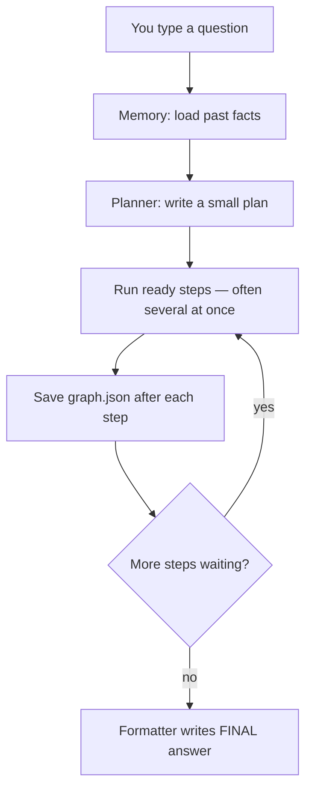
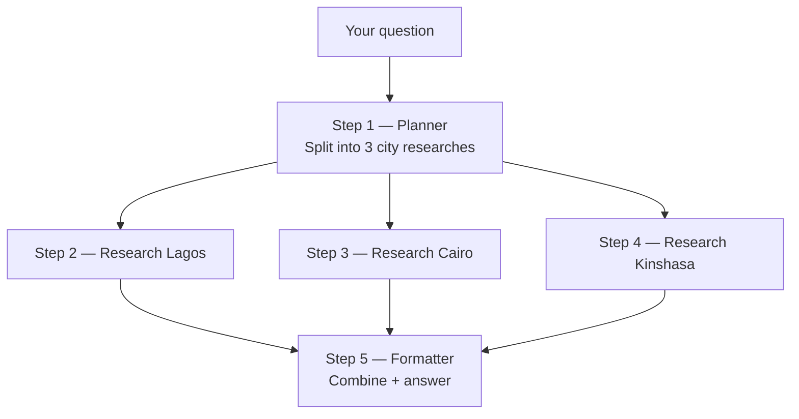
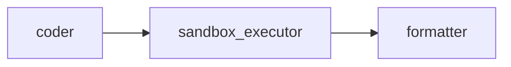
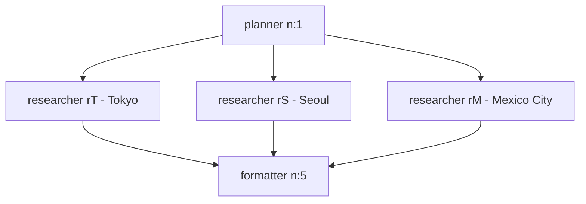
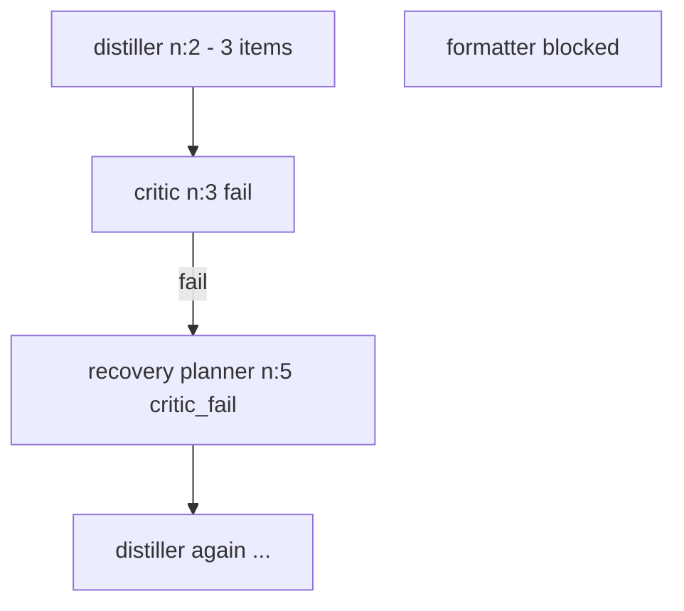

# Understanding your agent runs (`state/sessions/`)

Companion to [`S8SharedCode/README.md`](../../../README.md). That file is the **package overview and quickstart**; this file is the **session DAG guide** plus **recorded runs** and **paths for everything changed in this build**.

**Package root (run commands from `code/`):**

`EAG_S8/S8SharedCode/`

When you run:

```bash
cd EAG_S8/S8SharedCode/code
uv run python flow.py "your question"
```

the orchestrator saves everything under **`EAG_S8/S8SharedCode/code/state/sessions/<sid>/`**, named like **`s8-7e3d1a31`**.  
Think of each folder as **one conversation attempt** — a small workflow the Planner designed, step by step.

**Recorded example sessions (jump to section):**

| Session | Topic | Section |
|---------|--------|---------|
| `s8-7e3d1a31` | hello (2 steps) | Example A |
| **`s8-e4b78873`** | **sum 1..1M via coder + sandbox** | **Example D** · [Coder + sandbox test](#coder--sandbox-test-exact-computation) |
| **`s8-899fe22c`** | **index sandbox/papers, find DPO** | **Example E** · [Corpus indexer](#corpus-indexer-sandbox-papers--faiss) |
| `s8-94a84720` | 3-city fan-out (web) | Fan-out · `verify_fanout.py` |
| `s8-cadb1096` / `s8-414ef814` | critic pass / fail | [Critic verdict test](#critic-verdict-test-pass-vs-fail--recovery) |

---

## S8 package layout (from README.md)

Paths below are relative to **`EAG_S8/S8SharedCode/`** unless noted.

```text
S8SharedCode/
├── README.md                    ← package overview, quickstart, troubleshooting
├── .env.example                 ← copy to S8SharedCode/.env (or gateway/.env)
├── .gitignore
│
├── code/                        ← agent; run flow.py from HERE
│   ├── flow.py                  ← orchestrator (Graph + Executor + CLI)
│   ├── skills.py                ← skill registry, prompts, MCP tool catalog
│   ├── recovery.py              ← failure classification + critic-fail splice
│   ├── persistence.py           ← writes state/sessions/<sid>/
│   ├── mcp_runner.py            ← multi-turn tool-use loop
│   ├── sandbox.py               ← subprocess Python runner (Coder output)
│   ├── replay.py                ← stdin trace viewer per session
│   ├── verify_fanout.py         ← fan-out timing verifier (added this build)
│   ├── schemas.py
│   ├── agent_config.yaml        ← skills catalogue (Coder, corpus_indexer, …)
│   ├── gateway.py               ← HTTP client to LLM gateway :8108
│   ├── mcp_server.py            ← MCP tools (web, files, index, search_knowledge)
│   ├── memory.py / vector_index.py / artifacts.py
│   ├── prompts/                 ← one .md per skill
│   │   ├── planner.md
│   │   ├── coder.md             ← implemented (was stub)
│   │   ├── corpus_indexer.md    ← new skill (this build)
│   │   ├── critic.md / distiller.md / formatter.md / …
│   │   └── sandbox_executor.md
│   ├── tests/
│   │   └── test_recovery.py
│   ├── sandbox/
│   │   └── papers/              ← attention.md, cot.md, dpo.md, lora.md, react.md
│   └── state/
│       ├── memory.json          ← FAISS-backed memory store
│       └── sessions/            ← YOU ARE HERE (readmedag.md + s8-* runs)
│           ├── readmedag.md
│           ├── _corpus_indexer_query.txt
│           ├── _critic_pass_query.txt / _critic_fail_query.txt
│           └── s8-<id>/         ← query.txt, graph.json, nodes/n_*.json
│
└── gateway/                     ← LLM Gateway V8, http://localhost:8108
    ├── main.py
    ├── client.py
    ├── providers.py / router.py / embedders.py / db.py / cache.py
    ├── agent_routing.yaml       ← skill → provider pins (openai default)
    ├── gateway_v8.db
    ├── pyproject.toml
    ├── run.sh
    └── run.ps1                  ← Windows; ASCII-only (fixed this build)
```

---

## Quickstart paths (README.md)

| Step | Path / command |
|------|----------------|
| Secrets template | `S8SharedCode/.env.example` → copy to `S8SharedCode/.env` |
| Install gateway | `cd S8SharedCode/gateway && uv sync` |
| Install agent | `cd S8SharedCode/code && uv sync` |
| Start gateway | `cd S8SharedCode/gateway && uv run main.py` or `.\run.ps1` |
| Gateway URL | `http://localhost:8108` (`GATEWAY_V8_PORT` in `.env`) |
| Run agent | `cd S8SharedCode/code && uv run python flow.py "hello"` |
| Session output | `S8SharedCode/code/state/sessions/s8-<hex>/` |
| Replay a run | `cd S8SharedCode/code && uv run python replay.py s8-<id>` |
| Fan-out verify | `cd S8SharedCode/code && uv run python verify_fanout.py s8-<id>` |

On Windows, set `$env:PYTHONUTF8="1"` before `flow.py` if the terminal mangles box-drawing or em dashes in output.

---

## Architecture (README.md + this build)

| Mechanism | Where | What it does |
|-----------|--------|--------------|
| Growing DAG | `code/flow.py` | Planner seeds nodes; skills run in parallel waves |
| `internal_successors` | `code/agent_config.yaml` | **Coder** auto-adds **sandbox_executor** after coder finishes |
| Formatter rewire | `code/flow.py` | After sandbox insert, formatter waiting on coder is rewired to sandbox **stdout** |
| `critic: true` | `distiller` in yaml | Critic auto-inserted before distiller children |
| Critic fail recovery | `code/recovery.py` | `recovery_reason: critic_fail` → recovery planner |
| MCP tools per skill | `code/skills.py` `_TOOL_CATALOG` | Gateway tool-use channel; extended for **corpus_indexer** |
| Provider pins | `gateway/agent_routing.yaml` | Per-skill default provider (e.g. `coder: openai`) |
| Sessions | `code/persistence.py` | `state/sessions/<sid>/graph.json` + `nodes/n_*.json` |

Read `code/flow.py` first (README recommendation). Do **not** patch `mcp_server.py`, `memory.py`, etc. per README “What NOT to touch” unless fixing a confirmed bug.

---

## Actual changes in this build (paths)

Summary of work beyond stock Session 8 scaffolding. **No `flow.py` change** required for **corpus_indexer**; **one small `flow.py` change** for **coder** formatter rewire.

### Gateway (S7 → V8 on port 8108)

| Path | Change |
|------|--------|
| `S8SharedCode/gateway/main.py` | V8 routes: batch chat, cost-by-agent, reload `agent_routing.yaml` per request |
| `S8SharedCode/gateway/router.py` | OpenAI in LIMITS/SHORTCUTS |
| `S8SharedCode/gateway/providers.py` | `OpenAIProvider` |
| `S8SharedCode/gateway/embedders.py` | `OpenAIEmbedder` |
| `S8SharedCode/gateway/agent_routing.yaml` | Skills pinned to **openai** (incl. `critic`, `coder`, `corpus_indexer`) |
| `S8SharedCode/gateway/run.ps1` | ASCII-only; fixes Windows parse errors |
| `S8SharedCode/.env.example` | `GATEWAY_V8_PORT=8108`, `LLM_GATEWAY_V8_URL` notes |
| `S8SharedCode/code/gateway.py` | Client targets port **8108** |

### Orchestrator & env fixes

| Path | Change |
|------|--------|
| `S8SharedCode/code/flow.py` | Rewire formatter to **sandbox_executor** when coder finishes (not coder source) |
| `S8SharedCode/code/memory.py` | `import os` for classifier / `AGENT_LLM_PROVIDER` |

### Skills implemented or added

| Path | Change |
|------|--------|
| `S8SharedCode/code/prompts/coder.md` | Full Coder prompt; JSON `{"code", "rationale"}` |
| `S8SharedCode/code/agent_config.yaml` | `coder` description; **`corpus_indexer`** entry |
| `S8SharedCode/code/prompts/corpus_indexer.md` | **New skill** — `list_dir` + `index_document` |
| `S8SharedCode/code/prompts/planner.md` | Coder, corpus_indexer examples and skill list |
| `S8SharedCode/code/skills.py` | **`_TOOL_CATALOG`**: `list_dir`, `index_document` (reportable; not in README stub) |
| `S8SharedCode/code/prompts/critic.md` | Used for pass/fail tests (existing) |
| `S8SharedCode/gateway/agent_routing.yaml` | `critic: openai` (was groq) |

### Verification & docs

| Path | Change |
|------|--------|
| `S8SharedCode/code/verify_fanout.py` | Parallel fan-out wall-clock checker |
| `S8SharedCode/code/state/sessions/readmedag.md` | This file — DAG guide + recorded sessions |
| `S8SharedCode/code/state/sessions/_corpus_indexer_query.txt` | Corpus indexer demo query |
| `S8SharedCode/code/state/sessions/_critic_pass_query.txt` | Critic pass demo query |
| `S8SharedCode/code/state/sessions/_critic_fail_query.txt` | Critic fail + recovery demo query |

### Recorded session folders (under `code/state/sessions/`)

| Session folder | Requirement exercised |
|----------------|----------------------|
| `s8-7e3d1a31/` | Hello / basic planner → formatter |
| `s8-e4b78873/` | **Coder** + sandbox → formatter (sum 1..1M) |
| `s8-899fe22c/` | **Corpus indexer** (papers → FAISS); retriever 503 on same run |
| `s8-94a84720/` | Fan-out PASS (`verify_fanout.py`) |
| `s8-bbc2db62/` | Fan-out PASS (alt cities) |
| `s8-a3df1fe7/` | Fan-out FAIL (memory → single retriever) |
| `s8-cadb1096/` | Critic PASS |
| `s8-414ef814/` | Critic FAIL + recovery loop (node cap) |

---

## When things go wrong (README.md)

| Symptom | First place to look |
|---------|---------------------|
| Gateway won’t start | `S8SharedCode/gateway/` — `uv run main.py`, port **8108**, `.env` keys |
| `503` / `502` on planner or retriever | Provider quota; wait after heavy **corpus_indexer** embed load |
| `no code in upstream coder output` | `S8SharedCode/code/prompts/coder.md` — JSON shape |
| Wrong or empty **FINAL** | `uv run python replay.py <sid>` — `nodes/n_*.json` → `prompt_sent` |
| Fan-out not parallel | `uv run python verify_fanout.py <sid>`; query must avoid warm memory shortcut |

---

## The 30-second version

| What you see in the terminal | What it means |
|------------------------------|---------------|
| `session s8-abc123` | Folder name = `s8-abc123/` |
| `[n:1] planner complete` | Step 1 finished (Planner wrote the plan) |
| `[n:2] formatter complete` | Step 2 finished (Formatter wrote the answer) |
| `[n:2] coder` → `[n:4] sandbox_executor` → `[n:3] formatter` | Code run (`s8-e4b78873`) — sandbox prints numbers, formatter reads stdout |
| `FINAL: Hello! …` | The user-facing answer (from the **formatter** skill) |

**Three ideas:**

1. **Planner goes first** — it decides which skills to run and in what order.
2. **Skills run in waves** — anything that *can* run at the same time *does* (e.g. three researchers in parallel).
3. **Formatter goes last** — it turns all upstream work into the `FINAL:` line you read.

---

## What’s inside each session folder?

```text
s8-7e3d1a31/
  query.txt      ← exactly what you typed
  graph.json     ← the full workflow (all steps + results)
  nodes/
    n_001.json   ← details for step n:1
    n_002.json   ← details for step n:2
```

| File | Plain English |
|------|----------------|
| **query.txt** | Your original question |
| **graph.json** | The whole workflow in one file — open this to see the big picture |
| **nodes/n_001.json** | One step’s full record (`n:1` in the terminal = file `n_001.json`) |

**Step labels:** Terminal prints `n:1`, `n:2`, … Files use `n_001`, `n_002`, … (same step, different formatting).

**Step status:**

| Status | Meaning |
|--------|---------|
| `pending` | Not started yet |
| `running` | In progress |
| `complete` | Finished OK |
| `failed` | Error (often gateway / API) |
| `skipped` | Bypassed (e.g. critic said “fail”) |

---

## How a run works (big picture)



You do **not** need to read this diagram to use the agent — it’s here so file layouts make sense.

---

## Example A — “hi” (simple, 2 steps)

**Folder:** `s8-7e3d1a31`  
**Question:** `hi`

**Terminal:**

```text
[n:1] planner    complete (4.6s)
[n:2] formatter  complete (3.8s)
FINAL: Hello! How can I assist you today?
```

**Workflow diagram:**


**What happened:**

1. Planner decided: “just answer the greeting” → add a **formatter** step.
2. Formatter read your `hi` and produced `final_answer`.
3. That text became the **FINAL** line.

**Where to look:** `graph.json` → node `n:2` → `result.output.final_answer`.

---

## Example B — cities question (5 steps, parallel middle)

**Best verified fan-out:** `s8-94a84720` (Tokyo / Seoul / Mexico City) — see **`verify_fanout.py` results** below.  
**Older run:** `s8-bbc2db62` (Lagos / Cairo / Kinshasa) — same DAG shape, longer branch times (~86s wave).

**Folder:** `s8-bbc2db62`  
**Question:** Compare Lagos, Cairo, and Kinshasa (population + growth; which is fastest?)

**Workflow diagram:**



**Waves (time order):**

| Wave | Steps | What happens |
|------|-------|----------------|
| 1 | `n:1` planner | ~7 s — builds the plan |
| 2 | `n:2`, `n:3`, `n:4` researchers | ~85 s each — **all three run together** |
| 3 | `n:5` formatter | ~4 s — writes FINAL |

```text
Wave 1:  [ planner ]
Wave 2:  [ researcher Lagos ] [ researcher Cairo ] [ researcher Kinshasa ]  ← parallel
Wave 3:  [ formatter ]
```

**FINAL on this run:** The formatter said it could not find good data. The **workflow shape is still correct** (plan → 3 branches → merge); the researchers did not leave useful text in `output`. Check `nodes/n_002.json` … `n_004.json` if you debug tool results.

---

## Example D — exact sum via Coder + sandbox (`s8-e4b78873`)

**Folder:** `s8-e4b78873`  
**Question:** Exact sum of integers 1 through 1_000_000 — must come from **executed** Python stdout, not mental math.


| Wave | Node | Skill | Time | Key output |
|------|------|-------|------|------------|
| 1 | `n:1` | planner | 5.7s | Plan: `coder` (`py`) then `formatter` (`out`) |
| 2 | `n:2` | coder | 4.4s | `total = sum(range(1, 1_000_001)); print(total)` |
| 3 | `n:4` | sandbox_executor | 0.2s | stdout: **`500000500000`** |
| 4 | `n:3` | formatter | 4.3s | FINAL: **500,000,500,000** |

**Why `n:3` runs after `n:4`:** The orchestrator auto-adds sandbox after coder and **rewires** the formatter to depend on sandbox stdout (see `flow.py`), not on the Python source string.

**Re-run:**

```bash
cd S8SharedCode/code
$env:PYTHONUTF8="1"
uv run python flow.py "Compute the exact sum of all integers from 1 to 1_000_000 inclusive. Use the coder skill to run Python in the sandbox. Do not answer by mental math — the final answer must come from executed code stdout."
uv run python replay.py s8-e4b78873
```

Full write-up: [Coder + sandbox test](#coder--sandbox-test-exact-computation) (query copy-paste, `graph.json` checks).

---

## Example E — corpus indexer (`s8-899fe22c`)

**Folder:** `s8-899fe22c`  
**Question:** Index all `sandbox/papers/*.md`, then find which file discusses DPO.

| Wave | Node | Skill | Time | Key output |
|------|------|-------|------|------------|
| 1 | `n:1` | planner | 6.5s | `corpus_indexer` → `retriever` → `formatter` |
| 2 | `n:2` | corpus_indexer | 92.6s | 5 files, **15 chunks** indexed |
| 3 | `n:3` | retriever | 0.0s | **Failed** — gateway 503 after embed load |

Indexer **passed**; retriever failed on this run (transient). Expected answer when retriever succeeds: **`papers/dpo.md`**.

Full write-up: [Corpus indexer](#corpus-indexer-sandbox-papers--faiss).

---

## Example C — when something breaks

**Folder:** `s8-e60f38ea` (early gateway issues)


| Symptom | Likely cause |
|---------|----------------|
| `planner failed` + `502` / `503` | Gateway down, wrong port, or provider quota (e.g. Gemini billing) |
| Empty **FINAL** | Planner never finished, so no formatter step was added |
| `transient gateway error; not re-planning` | Gateway already retried; orchestrator won’t spam new plans |

**Fix checklist:** Gateway running on **8108** (`.\run.ps1` in `gateway/`), OpenAI key in `.env`, `agent_routing.yaml` pointing to a working provider.

---

## Skills cheat sheet

Each **node** is one call to a **skill** (defined in `agent_config.yaml`).

| Skill | What it does (simple) |
|-------|------------------------|
| **planner** | Breaks your question into steps; never uses tools |
| **researcher** | Searches the web |
| **corpus_indexer** | `list_dir` + `index_document` on sandbox files → FAISS facts |
| **retriever** | Searches saved memory / FAISS index |
| **distiller** | Pulls structured facts from text |
| **summariser** | Shortens long text |
| **critic** | Checks if upstream output is good enough |
| **coder** | Writes Python (`prompts/coder.md`); emits `{"code": "...", "rationale": "..."}` |
| **sandbox_executor** | Runs that code in a subprocess (auto-added after coder; no LLM) |
| **formatter** | Writes the final answer you see as **FINAL** |

**Common chain for coding tasks:**



**Common chain for on-disk papers:**


---

## Reading `graph.json` without drowning in JSON

Open `graph.json` and focus on **`nodes`** — one object per step.

**Quick checklist per node:**

1. **`skill`** — which agent ran (`planner`, `formatter`, …)
2. **`status`** — `complete` or `failed`?
3. **`result.elapsed_s`** — how long it took
4. **`result.provider`** — e.g. `openai`
5. **`result.output`** — the skill’s JSON reply
6. For the last formatter: **`result.output.final_answer`** = your **FINAL** text

**Edges** (`"edges": [ … ]`) show “step A must finish before step B” when the graph recorded them.  
Some simple runs have an empty `edges` list; order still comes from **`inputs`** (e.g. formatter waits until researchers `n:2`, `n:3`, `n:4` are done).

---

## Your saved sessions (quick index)

| Folder | Question (short) | Steps | Result |
|--------|------------------|-------|--------|
| `s8-7e3d1a31` | hi | planner → formatter | Worked |
| `s8-e4b78873` | Sum 1..1_000_000 (coder + sandbox) | planner → coder → sandbox → formatter | **Coder PASS** (see below) |
| `s8-899fe22c` | Index papers + find DPO | indexer OK; retriever 503 same run | **Indexer PASS** (see below) |
| `s8-94a84720` | Tokyo / Seoul / Mexico City (web) | 3× researcher → formatter | **Fan-out PASS** (see below) |
| `s8-bbc2db62` | Lagos / Cairo / Kinshasa | 3× researcher → formatter | **Fan-out PASS** |
| `s8-a3df1fe7` | London / Paris / Berlin | 1× retriever only | **Fan-out FAIL** (memory shortcut) |
| `s8-cadb1096` | Shannon SOURCE — exactly 3 contributions | distiller → critic → formatter | **Critic PASS** |
| `s8-414ef814` | Shannon SOURCE — exactly 4 (impossible) | critic fail + recovery loop | **Critic FAIL** (node cap 60) |
| `s8-f41d6af3` | (see `query.txt`) | 2 steps | Short run |
| `s8-9146a5ac` | (see `query.txt`) | 5 steps | Multi-step |
| `s8-197408bb` | hi | planner only | Failed (gateway) |
| `s8-e60f38ea` | hi | planner only | Failed (503) |

New runs add new `s8-*` folders automatically.

---

## Walk through a run step-by-step (replay)

From `S8SharedCode/code/`:

```bash
uv run python replay.py s8-7e3d1a31
```

| Key | Action |
|-----|--------|
| `n` | Next step |
| `p` | Show the prompt sent to the LLM |
| `g` | Graph summary |
| `q` | Quit |

Use replay when the terminal output is too short and you want to see **what the Planner actually asked each skill to do**.

---

## Glossary (one line each)

| Term | Meaning |
|------|---------|
| **DAG** | Directed graph of steps — no cycles, clear order |
| **Node / step** | One skill execution (`n:1`, `n:2`, …) |
| **USER_QUERY** | Your question, passed into prompts |
| **successors** | New steps the Planner (or a skill) adds after finishing |
| **FINAL** | The formatter’s `final_answer` printed at the end |

---

## Takeaway

- One folder = one `flow.py` run.  
- **Planner** designs the workflow; **formatter** produces what you read.  
- Parallel steps = same “wave” (faster for multi-part questions).  
- **`graph.json`** is the map; **`FINAL`** is the destination.

For a simple success, see **`s8-7e3d1a31`**. For **Coder + sandbox**, see **`s8-e4b78873`**. For **Corpus indexer**, see **`s8-899fe22c`**. For parallel fan-out, see **`s8-94a84720`**. For Critic pass/fail, see **`s8-cadb1096`** / **`s8-414ef814`** and the sections below.

---

## Fan-out test query (3+ parallel branches)

Use three **named items** plus a **comparison**, and ask for **live web search** so the Planner does not collapse into one `retriever` (memory shortcut).

### Recommended query (copy-paste)

```text
Use live web search only. For Tokyo, Seoul, and Mexico City separately, find each city's current population, then tell me which two cities are closest in population size.
```

### Run and verify

```bash
cd S8SharedCode/code
uv run python flow.py "Use live web search only. For Tokyo, Seoul, and Mexico City separately, find each city's current population, then tell me which two cities are closest in population size."
uv run python verify_fanout.py <session-id>
```

`verify_fanout.py` (in `code/`) checks:

1. First Planner plan has **≥ 3** `researcher` nodes with **`inputs: []`**
2. Parallel wave **wall-clock** ≈ **max** branch time (not the **sum**)
3. On failure, prints what the Planner actually chose (e.g. single `retriever`)

---

## `verify_fanout.py` results (recorded runs)

| Session | `verify_fanout` | Planner plan | Parallel researchers |
|---------|-----------------|--------------|----------------------|
| **`s8-94a84720`** | **PASS** | 3× `researcher` (`rT`, `rS`, `rM`) + formatter | Tokyo, Seoul, Mexico City |
| **`s8-bbc2db62`** | **PASS** | 3× `researcher` (`rL`, `rC`, `rK`) + formatter | Lagos, Cairo, Kinshasa |
| **`s8-a3df1fe7`** | **FAIL** | 1× `retriever` (`rCities`) + formatter | London / Paris / Berlin bundled — memory shortcut |

### Timing proof — parallel wall-clock = max, not sum

If the three researchers ran **one after another**, wall-clock would be roughly the **sum** of their `elapsed_s` values.  
Measured runs show wall-clock ≈ **max** branch time → `asyncio.gather` in `flow.py` ran them in one wave.

**`s8-94a84720`** (Tokyo / Seoul / Mexico City — canonical test query):

| Branch | `elapsed_s` | Label / city |
|--------|-------------|--------------|
| n:2 | 52.1s | `rT` Tokyo |
| n:3 | 51.5s | `rS` Seoul |
| n:4 | 49.9s | `rM` Mexico City |
| **Sum (if sequential)** | **153.6s** | |
| **Wall-clock (parallel wave)** | **52.1s** | min start → max end |
| **Max branch** | **52.1s** | |

```text
verify_fanout.py s8-94a84720
  PASS: wave time tracks max(branch), not sum(branches)
```

Planner rationale in `graph.json`: *"Fetch each city's population in parallel, then compare."*  
FINAL on this run still said it could not find populations (empty researcher `output` in JSON) — the **DAG and parallelism** are correct even when web tools return little data.

**`s8-bbc2db62`** (Lagos / Cairo / Kinshasa):

| Metric | Value |
|--------|-------|
| Sum of branch `elapsed_s` | **254.5s** |
| Wall-clock parallel wave | **86.2s** |
| Max branch | **86.2s** |

```text
verify_fanout.py s8-bbc2db62
  PASS: wave time tracks max(branch), not sum(branches)
```

**`s8-a3df1fe7`** (London / Paris / Berlin — do not use after memory is warm):

```text
verify_fanout.py s8-a3df1fe7
  Parallel researcher nodes: 0
  NOTE: Planner chose ONE retriever (memory shortcut), not 3 researchers.
  FAIL
```

---

## Expected DAG after a successful fan-out plan

**`s8-94a84720`** (actual labels from `graph.json`):



**Waves:**

```text
Wave 1:  [ planner ~6s ]
Wave 2:  [ Tokyo ] [ Seoul ] [ Mexico City ]   <- ~52s wall-clock, not ~154s
Wave 3:  [ formatter ~4s ]
```

---

## Why some queries do not fan out

| Situation | What Planner tends to do |
|-----------|---------------------------|
| **MEMORY HITS** for similar past queries (`s8-a3df1fe7`) | One **`retriever`**, not three **`researcher`** nodes |
| Single-topic question | One researcher |
| Vague region (“research Africa”) | One broad node |

**Checks after `flow.py`:**

1. `graph.json` → first planner → `output.nodes` → **three** `researcher` entries, distinct `metadata.label`
2. `uv run python verify_fanout.py <session-id>` → **PASS**

**Avoid** London / Paris / Berlin for fan-out tests if those cities are already in memory from earlier runs.

---

## Coder + sandbox test (exact computation)

Use this when the answer must come from **executed Python**, not mental math or prose guessing (large sums, counts, simulations). The Formatter should read **sandbox `stdout`**, not the Coder’s source string.

### Recommended query (copy-paste)

```text
Compute the exact sum of all integers from 1 to 1_000_000 inclusive. Use the coder skill to run Python in the sandbox. Do not answer by mental math — the final answer must come from executed code stdout.
```

### Run

```bash
cd S8SharedCode/code
$env:PYTHONUTF8="1"
uv run python flow.py "Compute the exact sum of all integers from 1 to 1_000_000 inclusive. Use the coder skill to run Python in the sandbox. Do not answer by mental math — the final answer must come from executed code stdout."
uv run python replay.py s8-e4b78873
```

### Recorded run — **`s8-e4b78873`**

| Step | Node | Skill | Time | Output (short) |
|------|------|-------|------|----------------|
| 1 | `n:1` | planner | 5.7s | `coder` (`py`) → `formatter` (`out`); formatter initially refs `n:py` |
| 2 | `n:2` | coder | 4.4s | `code`: `total = sum(range(1, 1_000_001))\nprint(total)\n` |
| 3 | `n:4` | sandbox_executor | 0.2s | `stdout`: `500000500000`, `exit_code`: 0 |
| 4 | `n:3` | formatter | 4.3s | **FINAL**: sum is **500,000,500,000** |

**Terminal shape:**

```text
session s8-e4b78873
[n:1] planner            complete (5.7s)
[n:2] coder              complete (4.4s)
[n:4] sandbox_executor   complete (0.2s)
[n:3] formatter          complete (4.3s)
FINAL: The exact sum of all integers from 1 to 1,000,000 inclusive is 500,000,500,000.
```

**Why node ids look out of order:** The Planner created formatter as `n:3` and sandbox as `n:4` when the orchestrator auto-inserted sandbox after coder. `flow.py` **rewired** formatter inputs from `n:2` (coder) to `n:4` (sandbox) so the Formatter waits for **stdout**, not Python source.

**Check `graph.json`:**

- Planner plan: `coder` + `formatter` with `inputs: ["USER_QUERY", "n:py"]`
- Edges: `n:2` → `n:4` → `n:3` (coder → sandbox → formatter)
- Sandbox: `500000500000` (= 1_000_000 × 1_000_001 / 2)

### Expected DAG (`s8-e4b78873`)


**Waves:**

```text
Wave 1:  [ planner ~6s ]
Wave 2:  [ coder ~4s ]
Wave 3:  [ sandbox ~0.2s ]   <- subprocess; no gateway LLM
Wave 4:  [ formatter ~4s ]
```

### Coder prompt contract

From `prompts/coder.md`:

- JSON only: `{"code": "<python>", "rationale": "<one line>"}`
- Stdlib only; **print** results to stdout; no `input()`, no markdown inside `code`
- Orchestrator passes `code` to `sandbox.run_python` via `internal_successors` in `agent_config.yaml`

### When to use Coder vs Formatter alone

| Situation | Route |
|-----------|--------|
| Exact large integer / counting / simulation | **coder** → sandbox → formatter |
| Facts already in MEMORY HITS or SOURCE text | distiller / retriever → formatter |
| Live numbers from the web | researcher → formatter |

Ask the Planner for **coder** explicitly and forbid mental math in the query if you want a sandbox proof run.

---

## Corpus indexer (sandbox/papers → FAISS)

**New skill:** `corpus_indexer` ingests markdown under `code/sandbox/` into vector memory using MCP `list_dir` and `index_document`. **Retriever** searches those chunks afterward. Use **researcher** for the web, not for files already on disk.

### Reportable change (not `flow.py`)

| File | Change |
|------|--------|
| `skills.py` | `_TOOL_CATALOG` extended with `list_dir`, `index_document` |
| `agent_config.yaml` | `corpus_indexer` entry + `tools_allowed` |
| `prompts/corpus_indexer.md` | Skill prompt |
| `prompts/planner.md` | Skill listed + example DAG |
| `gateway/agent_routing.yaml` | `corpus_indexer: openai` |

No changes to `flow.py`.

### Recommended query (copy-paste)

Saved as `state/sessions/_corpus_indexer_query.txt`:

```text
Index every markdown file under sandbox/papers/ using the corpus_indexer skill (list_dir then index_document for each file). Then use retriever to find which paper discusses direct preference optimization (DPO). Formatter: one short paragraph naming the paper filename and the main idea — use retriever chunks only, not the web.
```

### Run

```bash
cd S8SharedCode/code
$env:PYTHONUTF8="1"
uv run python flow.py (Get-Content -Raw state/sessions/_corpus_indexer_query.txt)
uv run python replay.py s8-899fe22c
```

If **retriever** fails with `503` / `ExceptionGroup` immediately after indexing (~90s of embed calls), wait a minute and run a **follow-up** (chunks are already in memory):

```text
Search indexed memory only (retriever, no web). Which sandbox/papers file discusses direct preference optimization (DPO)? Formatter: one paragraph naming the file and main idea from retriever chunks.
```

### Recorded run — **`s8-899fe22c`**

| Step | Node | Skill | Time | Result |
|------|------|-------|------|--------|
| 1 | `n:1` | planner | 6.5s | `corpus_indexer` (`idx`) → `retriever` (`ret`) → `formatter` (`out`) |
| 2 | `n:2` | **corpus_indexer** | **92.6s** | **PASS** — 5 files, **15 chunks** |
| 3 | `n:3` | retriever | 0.0s | **FAIL** — gateway `503` in MCP `ExceptionGroup` |
| … | recovery | | | Re-plans; retriever keeps failing; FINAL = planner JSON |

**Indexed files (`n_002.json`):**

| Path | Chunks |
|------|--------|
| `papers/attention.md` | 3 |
| `papers/cot.md` | 3 |
| `papers/dpo.md` | 3 |
| `papers/lora.md` | 3 |
| `papers/react.md` | 3 |

Expected answer when **retriever** succeeds: **`papers/dpo.md`** — Direct Preference Optimization (alternative to RLHF).

**Terminal (indexer wave):**

```text
session s8-899fe22c
[n:1] planner            complete (6.5s)
[n:2] corpus_indexer     complete (92.6s)
[n:3] retriever          failed   (0.0s)  err=exception: ExceptionGroup ...
```

### Expected DAG (happy path)


**Waves:**

```text
Wave 1:  [ planner ~6s ]
Wave 2:  [ corpus_indexer ~90s ]   <- list_dir + 5x index_document + embed per chunk
Wave 3:  [ retriever ~5s ]         <- search_knowledge
Wave 4:  [ formatter ~4s ]
```

### Corpus indexer vs retriever

| Skill | Tools | Role |
|-------|-------|------|
| **corpus_indexer** | `list_dir`, `index_document` | **Write** chunks into FAISS/Memory |
| **retriever** | `search_knowledge` | **Read** chunks already indexed |

### When to use corpus_indexer

| Situation | Route |
|-----------|--------|
| Markdown/PDF text already under `sandbox/` | **corpus_indexer** → retriever → formatter |
| Question needs live web data | researcher → formatter |
| Memory already has the chunks | retriever → formatter (skip indexer) |

---

## Critic verdict test (pass vs fail + recovery)

### What the Critic can actually check (no tools)

The Critic skill makes **no tool calls** (`prompts/critic.md`). In practice it usually sees:

- **UPSTREAM_OUTPUT** — the Distiller’s JSON (`fields.contributions`, dates, etc.)
- **`metadata.question`** on the critic node — your pass/fail rule in plain language
- **MEMORY HITS** — same FAISS hits as every other skill (can confuse verdicts if you rely on SOURCE text the critic never received)

The Critic only sees **USER_QUERY / SOURCE** when the Planner wires `USER_QUERY` into the critic’s `inputs`. Most plans use `inputs: ["n:d1"]` only, so **array-length checks** (count `contributions` in distiller JSON vs “exactly 3” or “exactly 4” in `metadata.question`) are the most reliable property — no tools, no SOURCE paragraph required in the critic prompt.

| Verifiable property | Critic can fail when… |
|---------------------|------------------------|
| **Array length** | `contributions` has 3 items but critic question says exactly **4** (or the reverse) |
| **Unsupported field** | Distiller adds a field not in SOURCE — only if critic also gets `USER_QUERY` |
| **Wrong dates** | `birth_year` ≠ SOURCE — needs `USER_QUERY` in critic inputs or dates in distiller output |
| **Fabricated item** | Extra contribution string — needs SOURCE visible to critic |

Do **not** ask the Critic to check live web facts, file contents, or sandbox output — it cannot.

**Provider pin:** `gateway/agent_routing.yaml` sets `critic: openai` (an earlier run used **groq** and false-failed when memory hits mentioned only “information theory”).

### Important wiring: explicit Critic in the Planner plan

`distiller` has `critic: true` in `agent_config.yaml`, but auto-insertion only runs when **new** children are added **after** the Distiller finishes. If the Planner already added `formatter` in the same plan, there is **no** Critic between them unless the Planner emits one (`planner.md` lines 43–47).

Your query must ask for **`distiller` → `critic` → `formatter`** and tell the Planner to wire **formatter inputs to the critic node** (`n:c1`), not straight to distiller.

### Shared SOURCE block (embed in both runs)

```text
SOURCE:
Claude Shannon was born in 1916 and died in 2001. His three contributions were information theory, digital circuit design theory, and cryptographic theory.
```

Saved copies: `state/sessions/_critic_pass_query.txt` and `_critic_fail_query.txt`.

---

### Recorded runs (Jun 2026)

| Session | Goal | Nodes | Critic (first) | Recovery | FINAL |
|---------|------|-------|----------------|----------|-------|
| **`s8-cadb1096`** | exactly **3** | 4 (`planner` → `distiller` → `critic` → `formatter`) | **`pass`** (~4.7s) | none | `final_answer` with 1916, 2001, 3 contributions |
| **`s8-414ef814`** | exactly **4** (SOURCE has 3) | **60** (node cap) | **`fail`** on every wave (“3 strings instead of 4”) | **19×** `critic-fail recovery` → recovery planners `n:5, n:9, …` | Raw critic JSON: `verdict: fail` (no formatter success) |

**Pass run — terminal (`~61s` total):**

```text
session s8-cadb1096
[n:1] planner     complete (6.7s)
[n:2] distiller   complete (5.0s)
[n:3] critic      complete (4.7s)    # no recovery line
[n:4] formatter   complete (4.6s)
FINAL: {"final_answer": {"birth_year": 1916, "death_year": 2001, "contributions": [...]}}
```

**`s8-cadb1096` planner plan (from `graph.json`):** distiller `d1` → critic `c1` (`question`: exactly 3 strings) → formatter `out` with `inputs: ["USER_QUERY", "n:c1"]`.

**Fail run — first wave only (`s8-414ef814`):**

```text
[n:3] critic      complete
  ↪ critic-fail recovery: planner node n:5 for n:2
```

- **`n:3` verdict:** `"fail"` — *"The contributions field is an array of 3 strings instead of the required 4."*
- **Recovery planner `n:5` metadata:** `recovery_reason: "critic_fail"`, `recovers: "n:2"`
- Recovery planners kept re-emitting the same distiller→critic→formatter shape; distiller honestly returns **3** items from SOURCE, critic correctly keeps failing → loop until **`[flow] node cap 60 hit`**.

This fail run **proves** critic fail + recovery wiring; it does **not** reach a “corrected” formatter FINAL because the constraint (4 items) contradicts SOURCE (3 items). For a course demo of recovery **success**, relax the fail query to something recoverable (e.g. distiller omits `death_year`, critic fails, recovery adds it).

---

### Run 1 — expect **pass** (`verdict: pass`)

**Query (copy-paste)** — also in `_critic_pass_query.txt`:

```text
Extract birth_year, death_year, and contributions (array of exactly 3 strings) from SOURCE below only.

Use distiller, then critic, then formatter. Wire formatter inputs to the critic node (n:critic label), not directly to distiller.

Critic rule (put in critic metadata.question): Pass only if the distiller JSON field contributions is an array of exactly 3 strings. Count elements in the array; do not use memory hits.

SOURCE:
Claude Shannon was born in 1916 and died in 2001. His three contributions were information theory, digital circuit design theory, and cryptographic theory.
```

```bash
cd S8SharedCode/code
$env:PYTHONUTF8="1"
uv run python flow.py (Get-Content -Raw state/sessions/_critic_pass_query.txt)
# expect session like s8-cadb1096
```

---

### Run 2 — expect **fail** + recovery (`verdict: fail`)

**Query (copy-paste)** — also in `_critic_fail_query.txt`:

```text
Extract birth_year, death_year, and contributions (array of exactly 4 strings) from SOURCE below only.

Use distiller, then critic, then formatter. Wire formatter inputs to the critic node (n:critic label), not directly to distiller.

Critic rule (put in critic metadata.question): Fail unless the distiller JSON field contributions is an array of exactly 4 strings. Count elements in the array; do not use memory hits.

SOURCE:
Claude Shannon was born in 1916 and died in 2001. His three contributions were information theory, digital circuit design theory, and cryptographic theory.
```

**Why the first critic fails:** Distiller outputs **3** strings; critic `metadata.question` requires **4** → deterministic **`fail`** without reading SOURCE.

**Observed on `s8-414ef814`:** repeated recovery loops (~6 min) until node cap; FINAL is last critic fail JSON, not formatter output.

---

### DAG diagram (recorded pass shape — `s8-cadb1096`)


**Fail path (first wave — `s8-414ef814`):**



---

### Why this is two queries, not one

Same SOURCE, different **count** in critic `metadata.question` (3 vs 4). Run 1 passes when distiller returns 3 items. Run 2 fails on count even when distiller is faithful to SOURCE.

| Run | Session | Constraint | First critic | Recovery |
|-----|---------|------------|--------------|----------|
| Pass | `s8-cadb1096` | exactly **3** | `pass` | none |
| Fail | `s8-414ef814` | exactly **4** | `fail` | many (`critic_fail`), cap at 60 nodes |

**Lesson from `s8-f306eae9` (earlier attempt):** critic on **groq** false-failed when checking SOURCE support without `USER_QUERY` in inputs; memory hits dominated. Use **array-length** rules + **`critic: openai`**.

---

### Quick validation checklist

| Step | Pass (`s8-cadb1096`) | Fail (`s8-414ef814`) |
|------|----------------------|----------------------|
| Planner emits `critic` between distiller and formatter | yes | yes |
| Formatter `inputs` include critic node | yes (`n:3`) | yes (blocked until pass) |
| Critic `verdict` | `pass` | `fail` (every wave) |
| Terminal `critic-fail recovery` | no | yes (×19) |
| `recovery_reason: critic_fail` in recovery planner | no | yes |
| FINAL | `final_answer` JSON | critic `fail` JSON at node cap |

```bash
cd S8SharedCode/code
uv run python replay.py s8-cadb1096   # critic pass + formatter
uv run python replay.py s8-414ef814   # recovery loop + cap
```
